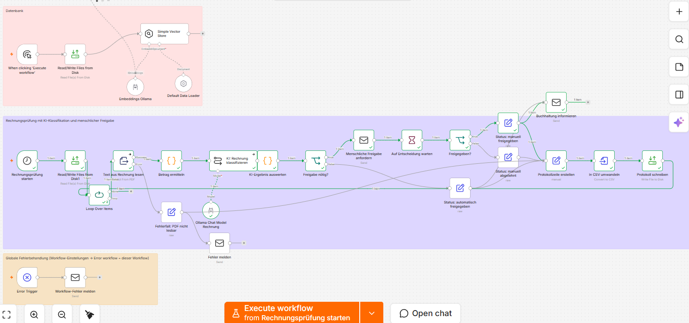
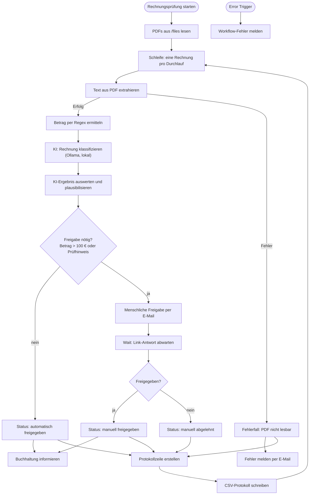

# Rechnungsprüfung mit KI-Klassifikation und menschlicher Freigabe (n8n)

Workflow-Datei: `Hausaufgabe_Modul3_Woche2_Tag3.json`
Workflow-Name in n8n: „Hausaufgabe Modul3_Woche2_Tag3“

## 1. Kurzbeschreibung

Der Workflow besteht aus zwei unabhängigen Teilen:

1. **Wissensdatenbank (unverändert):** PDFs aus `/files` werden mit `qwen3-embedding:0.6b` in einen Simple Vector Store geladen. Ein Chat-Agent (`llama3.2`) beantwortet Fragen auf Basis dieser Dokumente.
2. **Rechnungsprüfung (erweitert):** Eingangsrechnungen (PDF) werden gelesen, der Betrag wird per Regex ermittelt, ein lokales KI-Modell klassifiziert die Rechnung (Lieferant, Rechnungsnummer, Kategorie, Zusammenfassung) und plausibilisiert den Betrag. Ist die Rechnung groß oder auffällig, **entscheidet ein Mensch per E-Mail-Freigabe**. Jede Verarbeitung wird protokolliert, Fehler werden gemeldet.

Gelöstes Problem: Rechnungen werden bisher manuell geöffnet, gelesen, kategorisiert und weitergeleitet. Das ist zeitaufwendig und fehleranfällig. Der Workflow nimmt Routinefälle ab und legt kritische Fälle gezielt einem Menschen vor.

## 2. Ziel und Nutzen

| Ziel | Wirkung |
|---|---|
| Zeit | Kleine, unauffällige Rechnungen laufen ohne manuelle Sichtung durch; Kategorie und Zusammenfassung liegen sofort vor |
| Qualität | Doppelte Betragsermittlung (Regex und KI) deckt Lesefehler auf; einheitliche Kategorien |
| Fehlerquote | Abweichungen, unlesbare PDFs und KI-Ausfälle landen nie still im Nichts, sondern erzeugen Freigabe oder Fehlermeldung |
| Nachvollziehbarkeit | Jede Entscheidung steht mit Zeitpunkt und Status im CSV-Protokoll |
| Kosten | Lokales Modell (Ollama) verursacht keine API-Kosten und gibt keine Daten an Dritte |

Messgrößen siehe Abschnitt 12.

## 3. Beschreibung der Erweiterung

Ursprünglich las der Zweig alle PDFs und schickte bei Beträgen über 100 € eine E-Mail. Ergänzt bzw. geändert wurde:

| Erweiterung | Kategorie laut Aufgabe | Warum |
|---|---|---|
| Knoten **KI: Rechnung klassifizieren** (Ollama, `llama3.2`) | KI-Modell, Klassifikation, Zusammenfassung | Strukturierte Daten (Lieferant, Kategorie, Zusammenfassung) ohne Handarbeit |
| Knoten **KI-Ergebnis auswerten** | Qualitätssicherung, Fallback | Prüft JSON, erlaubte Kategorien, vergleicht KI-Betrag mit Regex-Betrag; bei Zweifel Freigabe |
| **Menschliche Freigabe anfordern** (E-Mail mit Freigabe-/Ablehnen-Link) und **Auf Entscheidung warten** (Wait-Knoten, Webhook) | Menschliche Freigabe | Finanzielle Entscheidung bleibt beim Menschen; je Rechnung eine eigene Freigabe |
| **Loop Over Items** (Batchgröße 1) | Robustheit | Jede Rechnung durchläuft Prüfung und Freigabe einzeln; sonst würde bei mehreren PDFs nur eine Freigabe angefordert |
| **Protokollzeile → CSV → Datei** | Protokollierung | Nachweis und Auswertbarkeit |
| **Fehlerausgang** der PDF-Extraktion, **Fehler melden**, **Error Trigger** | Fehlerbehandlung, Benachrichtigung | Kein stilles Scheitern |
| Neuer Trigger **Rechnungsprüfung starten** (Schedule Trigger) | Korrektur | Im Original war der Rechnungszweig fälschlich an den Ausgang des AI Agents gehängt und lief bei jeder Chatfrage mit |

Entfernt wurden die Knoten `Betrag > 100?`, `E-Mail senden` und `Keine Aktion (unter 100 €)`; ihre Aufgaben übernehmen `Freigabe nötig?`, `Buchhaltung informieren` und die Status-Knoten.

## 4. Ablauf des Workflows

   Das Ablaufdiagramm steht in `docs/ablaufdiagramm.mmd` und wird unten direkt angezeigt. Der Screenshot zeigt den Workflow in n8n nach einem erfolgreichen Lauf:

   



Schritte:

1. **Rechnungsprüfung starten:** Schedule Trigger (täglich 8 Uhr). Zum Testen lässt er sich über „Execute workflow“ manuell starten. Ein zweiter Manual Trigger ist in n8n nicht erlaubt, da der Manual Trigger bereits die Wissensdatenbank startet.
2. **Read/Write Files from Disk1 und Loop Over Items:** liest `/files/*.pdf`; die Schleife verarbeitet eine Datei pro Durchlauf.
3. **Text aus Rechnung lesen:** extrahiert den PDF-Text. Bei Fehler (defekt, passwortgeschützt) wird der Fehlerausgang genutzt.
4. **Betrag ermitteln:** Regex sucht Stichworte wie Gesamtbetrag, Summe, Total; Fallback ist der größte Betrag mit €/EUR. Ergebnis: `betrag`, `betrag_gefunden`.
5. **KI: Rechnung klassifizieren:** Ollama liefert JSON mit `lieferant`, `rechnungsnummer`, `betrag_brutto`, `kategorie`, `zusammenfassung`. Temperatur 0, Rechnungstext auf 4000 Zeichen begrenzt, Systemprompt behandelt den Text als reine Daten (Schutz vor Prompt-Injection).
6. **KI-Ergebnis auswerten:** parst die Antwort tolerant (auch in Codeblöcken), akzeptiert nur erlaubte Kategorien, vergleicht Beträge und setzt `freigabe_noetig`, wenn Betrag > 100 € (Konstante `SCHWELLE`) **oder** mindestens ein Prüfhinweis besteht (KI-Ausfall, kein Betrag, Abweichung, unklare Kategorie).
7. **Freigabe nötig?** Nein: **automatisch freigegeben**. Ja: weiter mit 8.
8. **Menschliche Freigabe anfordern und warten:** E-Mail mit Eckdaten und zwei Links („Freigeben“/„Ablehnen“), die auf die Resume-URL des wartenden Workflows zeigen. Der Wait-Knoten pausiert, bis ein Link geöffnet wird (Bot-Aufrufe durch Mailscanner werden ignoriert).
9. **Freigegeben?** Prüft den Parameter `entscheidung` des Links. Setzt `manuell_freigegeben` bzw. `manuell_abgelehnt`.
10. **Buchhaltung informieren:** E-Mail nur bei freigegebenen Rechnungen.
11. **Protokoll:** eine CSV-Zeile pro Rechnung (`zeitpunkt, dateiname, lieferant, rechnungsnummer, betrag, kategorie, status, hinweise`) wird an `/files/rechnungsprotokoll.csv` angehängt.
12. **Fehlerpfade:** Unlesbare PDFs werden protokolliert (`fehler_pdf_nicht_lesbar`) und gemeldet. Der **Error Trigger** meldet alle übrigen Abbrüche per E-Mail. Fällt die KI aus, läuft der Workflow mit Regex-Ergebnis weiter und verlangt Freigabe.

## 5. Tools und KI-Modelle

| Komponente | Verwendung | Begründung |
|---|---|---|
| n8n | Orchestrierung | Visuelle, versionierbare Workflows, selbst hostbar |
| Ollama + `llama3.2:latest` | Klassifikation/Zusammenfassung (und Chat-Agent) | Läuft lokal, keine Datenübertragung an Dritte, keine Tokenkosten, für kurze Extraktionsaufgaben ausreichend |
| Ollama + `qwen3-embedding:0.6b` | Embeddings für den Vector Store | Klein, lokal, mehrsprachig |
| Simple (In-Memory) Vector Store | Wissensdatenbank | Einfach für Prototyp; für Produktion durch persistenten Store ersetzen |
| SMTP (Send Email) und Wait-Knoten | Freigabe und Benachrichtigung | Kein zusätzlicher Dienst nötig; Zertifikatsprüfung ist je Knoten steuerbar |
| Dateisystem (`/files`) | Eingang und Protokoll | Einfachste Anbindung |

Die KI trifft **keine Zahlungsentscheidung**; sie liefert nur Vorschläge. Die Betragsprüfung ist bewusst regelbasiert.

## 6. Daten

| Datenart | Beispiele | Personenbezug / Vertraulichkeit |
|---|---|---|
| Rechnungs-PDFs | Lieferant, Beträge, Positionen, IBAN, Rechnungsnummer | Geschäftsvertraulich; bei Einzelunternehmern oder Ansprechpartnern **personenbezogen** (Name, Adresse, Bankdaten) |
| KI-Ausgabe | Kategorie, Zusammenfassung | abgeleitete Geschäftsdaten |
| Protokoll-CSV | Lieferant, Betrag, Status | geschäftsvertraulich |
| E-Mails | Eckdaten der Rechnung | interne Weitergabe |

Datenminimierung: Die Freigabe-Mail enthält nur Eckdaten, nicht den Volltext. Die Verarbeitung erfolgt lokal. Für den Test ausschließlich **fiktive Rechnungen** verwenden.

## 7. Integration im Unternehmen

Technisch:
- n8n (Docker oder Server) mit erreichbarer **Webhook-URL** (`WEBHOOK_URL`), sonst funktionieren die Freigabe-Links nicht
- Ollama-Server im internen Netz mit den beiden Modellen
- SMTP-Konto (Funktionspostfach, nicht privat)
- Eingangsordner `/files` als Volume; Zugriff per Berechtigungen beschränkt
- Persistenter Vector Store, Backups der Workflow-Exporte im Git-Repository
- Später: Anbindung an das Buchhaltungs-/ERP-System und Ersatz des manuellen Triggers

Organisatorisch:

| Rolle | Verantwortung |
|---|---|
| Fachbereich Buchhaltung (Process Owner) | Freigabegrenze, Kategorien, Prüfregeln, Freigabeberechtigte |
| IT/Automatisierung | Betrieb, Updates, Monitoring, Zugangsdaten, Backup |
| Datenschutzbeauftragter | Verzeichnis der Verarbeitungstätigkeiten, DSFA-Prüfung |
| Informationssicherheit | Freigabe der Architektur, Zugriffskonzept |
| Betriebsrat | Beteiligung (siehe 8) |

Änderungen am Workflow laufen über Git (Pull Request, Vier-Augen-Prinzip) und werden erst nach Test in Produktion übernommen.

## 8. Governance und Compliance

- **Datenschutz (DSGVO):** Rechtsgrundlage typischerweise Art. 6 Abs. 1 lit. b/c/f (Vertragserfüllung, rechtliche Pflichten, berechtigtes Interesse). Eintrag ins Verzeichnis der Verarbeitungstätigkeiten, Löschkonzept für Protokoll und PDFs (Aufbewahrungsfristen beachten), Zugriffsbeschränkung. Durch lokales Hosting keine Drittlandübermittlung; bei Cloud-Modellen wäre ein AV-Vertrag nötig.
- **Informationssicherheit:** Zugangsdaten nur im n8n-Credential-Store, nicht im Repository; Rechte nach Need-to-know; Protokollierung; TLS für SMTP; Webhook-URL nicht öffentlich ungeschützt betreiben.
- **EU AI Act:** Das System extrahiert und klassifiziert Dokumente und unterstützt eine Entscheidung, die ein Mensch trifft. Es fällt voraussichtlich **nicht** in die Hochrisiko-Kategorie (kein Anhang-III-Bereich wie Personalwesen oder Kreditwürdigkeit natürlicher Personen); das ist vom Unternehmen zu bestätigen. Zu beachten sind die Pflicht zur **KI-Kompetenz** der Mitarbeitenden (Art. 4) und die Kennzeichnung KI-generierter Inhalte in Mails („KI-Vorschlag“). Wird der Workflow später für Personalentscheidungen o. Ä. genutzt, ist neu zu bewerten.
- **Urheberrecht:** Verarbeitet werden eigene Geschäftsunterlagen. Modelllizenzen (Llama-Lizenz, Qwen) sind für die geplante Nutzung zu prüfen. Es werden keine fremden Werke trainiert oder veröffentlicht.
- **Mitbestimmung:** Technische Einrichtungen, die Verhalten oder Leistung überwachen *können*, unterliegen § 87 Abs. 1 Nr. 6 BetrVG. Der Workflow wertet keine Mitarbeiterdaten aus; das Freigabeprotokoll enthält jedoch Freigabezeitpunkte. Betriebsrat daher informieren, ggf. Betriebsvereinbarung.
- **Interne Richtlinien:** Vier-Augen-Prinzip, Freigabegrenzen, Aufbewahrung (GoBD) und KI-Nutzungsrichtlinie des Unternehmens einhalten.

Hinweis: Dies ist keine Rechtsberatung; die Punkte sind mit Datenschutz und Recht abzustimmen.

## 9. Risiken und Gegenmaßnahmen

| Risiko | Gegenmaßnahme |
|---|---|
| KI halluziniert Werte | Betrag wird gegen Regex geprüft; Abweichung erzwingt Freigabe; Mensch sieht Eckdaten |
| Falscher Betrag per Regex (z. B. Zwischensumme) | Höchster Treffer, KI-Gegenprüfung, Freigabe über 100 € |
| Prompt-Injection im PDF | Systemprompt: Text ist Daten; KI hat keine Werkzeuge und keine Schreibrechte; Ausgabe wird validiert |
| Scan-PDFs ohne Text | `betrag_gefunden = false` führt zur Freigabe; OCR als Ausbaustufe |
| KI/Ollama nicht erreichbar | `On Error: Continue`, Fallback auf Regex, Freigabe erforderlich |
| SMTP/Workflow bricht ab | Error Trigger meldet per E-Mail |
| Freigabe-Link wird weitergeleitet oder von einem Mailscanner abgerufen | Resume-URL enthält eine schwer erratbare Ausführungs-ID, „Ignore Bots“ ist aktiv, Funktionspostfach mit eingeschränktem Zugriff; für den Produktivbetrieb Freigabe mit Anmeldung (z. B. Formular mit Login, Teams/Slack-Approval) ergänzen |
| Pro Lauf mehrere PDFs, nur eine Freigabe | Schleife mit Batchgröße 1 |
| Freigabe-Mail nicht beantwortet | Workflow wartet; optional Wartezeit in der Node-Option „Limit Wait Time“ setzen und Eskalation ergänzen |
| Datenleck durch Mails oder Protokoll | Datenminimierung, Funktionspostfach, Dateirechte, Löschkonzept |
| Fehlentscheidung durch Schwellenwert | Schwelle zentral (`SCHWELLE`) und durch Fachbereich verantwortet |
| Abhängigkeit vom Modell/Update | Modellversion festschreiben, Regressionstest vor Update |
| Vector Store verliert Daten (In-Memory) | Für Produktion persistenten Store nutzen |

## 10. Menschliche Kontrolle

Ein Mensch prüft und gibt frei, wenn:
- der Betrag **über 100 €** liegt,
- **kein Betrag** erkannt wurde,
- Regex- und KI-Betrag **abweichen**,
- die **Kategorie unklar** ist oder die **KI ausgefallen** ist.

Nur Rechnungen **bis 100 € ohne Auffälligkeit** werden automatisch freigegeben. Auch diese sind im Protokoll sichtbar und per Stichprobe (empfohlen: monatlich 5 %) zu prüfen. Die KI entscheidet nie allein über Zahlungen; die eigentliche Buchung/Zahlung bleibt außerhalb des Workflows.

## 11. Test

Testfälle und Ergebnisse stehen in `testnachweis.md`. Kurz:
- Die beiden Code-Knoten wurden mit Beispieldaten ausgeführt (siehe dort).
- Ende-zu-Ende-Test in n8n mit fiktiven PDFs: Fälle T1 bis T8.

## 12. Erfolgsmessung

| Kennzahl | Zielwert (Vorschlag) | Quelle |
|---|---|---|
| Anteil automatisch freigegebener Rechnungen | 40 bis 60 % | Protokoll |
| Korrekte Betragserkennung (Stichprobe) | ≥ 98 % | manueller Abgleich |
| Korrekte Kategorie | ≥ 90 % | Stichprobe |
| Bearbeitungszeit pro Rechnung | −50 % ggü. manuell | Zeitmessung vorher/nachher |
| Fehlklassifikation mit Folgekosten | 0 | Review |
| Unbehandelte Fehler | 0 | Error-Mails, Execution-Liste |

## 13. Installation und Nutzung

Voraussetzungen: n8n (aktuelle Version), Ollama, SMTP-Konto.

1. Modelle laden:
   ```bash
   ollama pull llama3.2
   ollama pull qwen3-embedding:0.6b
   ```
2. In n8n **Import from File** → `Hausaufgabe_Modul3_Woche2_Tag3.json`.
3. Credentials in n8n anlegen (nicht im Repository speichern):
   - **Ollama** (`Ollama account`): Base URL, z. B. `http://host.docker.internal:11434`
   - **SMTP** (`SMTP account`): Host, Port, Benutzer, Passwort/App-Passwort
4. In allen E-Mail-Knoten `fromEmail`/`toEmail` auf die eigene bzw. eine Funktionsadresse setzen (im Export steht eine Beispieladresse).
5. `WEBHOOK_URL` von n8n so setzen, dass die Freigabe-Links vom Empfänger erreichbar sind (für lokale Tests genügt `http://localhost:5678/`, wenn die Mail auf demselben Rechner geöffnet wird).
6. Ordner `/files` im Container bereitstellen und Protokoll mit Kopfzeile anlegen:
   ```bash
   echo "zeitpunkt,dateiname,lieferant,rechnungsnummer,betrag,kategorie,status,hinweise" > /files/rechnungsprotokoll.csv
   ```
7. Workflow-Einstellungen → **Error workflow** = dieser Workflow (für den Error Trigger).
8. Testrechnungen (fiktiv) nach `/files` legen, **Rechnungsprüfung starten** ausführen, Freigabe-Mail beantworten, Protokoll prüfen.
9. Für den Betrieb: Zeitplan im Knoten `Rechnungsprüfung starten` anpassen, Workflow speichern und aktivieren. Beim Testen nicht aktivieren, sondern manuell ausführen.

Anpassungen: Schwelle in `KI-Ergebnis auswerten` (`SCHWELLE`), Kategorien in Prompt und Liste `erlaubt`, Modell im Knoten `Ollama Chat Model Rechnung`.

Zertifikatsfehler (`self-signed certificate in certificate chain`): Tritt auf, wenn ein Virenscanner oder Proxy die TLS-Verbindung zum Mailserver aufbricht. In den E-Mail-Knoten ist deshalb „Ignore SSL Issues“ aktiviert. Für den Produktivbetrieb besser das Stammzertifikat per `NODE_EXTRA_CA_CERTS` hinterlegen und die Option abschalten.

Sicherheit: Keine Passwörter, API-Schlüssel oder echten Rechnungen ins Repository einchecken. Der Export enthält nur Credential-IDs, keine Geheimnisse.
